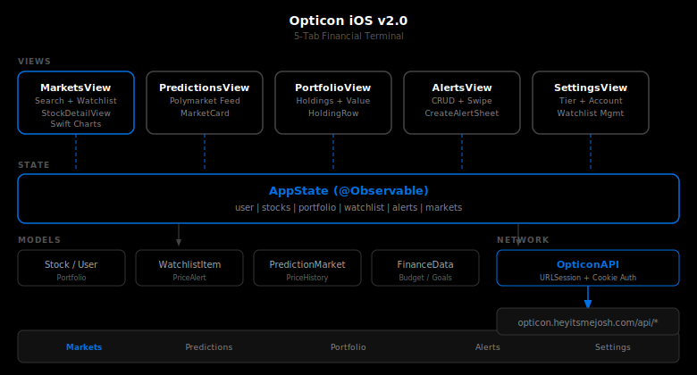

# Opticon iOS

Native iOS companion for the [Opticon](https://opticon.heyitsmejosh.com) financial terminal. Live market data, portfolio tracking, prediction markets, price alerts, and watchlist management -- wired directly to the Vercel API backend.

## Architecture



5-tab SwiftUI app observing a single `AppState` (@Observable). `AppState` delegates all network calls to `OpticonAPI`, a URLSession singleton with shared cookie storage for seamless session auth against the Vercel backend.

### Tabs

| Tab | View | Description |
|-----|------|-------------|
| Markets | `MarketsView` | Stock list with search, watchlist section, tap for detail with Swift Charts |
| Predictions | `PredictionsView` | Polymarket feed sorted by 24hr volume |
| Portfolio | `PortfolioView` | Holdings, total value, day change |
| Alerts | `AlertsView` | Price alert CRUD, swipe to delete, create sheet |
| Settings | `SettingsView` | Account info, subscription tier, watchlist management, sign out |

### API Endpoints

| Endpoint | Method | Auth | Description |
|----------|--------|------|-------------|
| `/api/auth?action=login` | POST | No | Login with email/password |
| `/api/auth?action=register` | POST | No | Create account |
| `/api/auth?action=me` | GET | Yes | Session check |
| `/api/auth?action=logout` | POST | Yes | End session |
| `/api/stocks` | GET | No | All stock quotes |
| `/api/history` | GET | No | Price history for chart |
| `/api/portfolio?action=get` | GET | Yes | Portfolio data |
| `/api/watchlist` | GET/POST/DELETE | Yes | Watchlist CRUD |
| `/api/alerts` | GET/POST/DELETE | Yes | Price alert CRUD |
| `/api/markets` | GET | No | Polymarket prediction markets |

## Build

Requires [xcodegen](https://github.com/yonaskolb/XcodeGen):

```bash
brew install xcodegen
cd opticon-ios
xcodegen generate
open Opticon.xcodeproj
```

Build target: iOS 17.0+, Swift 6.0.

### Run Tests

```bash
xcodegen generate
xcodebuild test -scheme OpticonTests -destination 'platform=iOS Simulator,name=iPhone 16'
```

## Models

| Model | File | Fields |
|-------|------|--------|
| `Stock` | `Models/Stock.swift` | symbol, name, price, change, changePercent, volume, high52, low52 |
| `User` | `Models/User.swift` | email, tier |
| `Portfolio` | `Models/Portfolio.swift` | totalValue, dayChange, holdings[] |
| `WatchlistItem` | `Models/WatchlistItem.swift` | id, symbol, addedAt |
| `PriceAlert` | `Models/Alert.swift` | id, symbol, targetPrice, direction, triggered |
| `PredictionMarket` | `Models/Market.swift` | id, question, volume24hr, liquidity, eventSlug |
| `FinanceData` | `Models/FinanceData.swift` | holdings, accounts, budget, debt, goals, spending |
| `PriceHistory` | `API/OpticonAPI.swift` | history[] with date, close, volume |

## Roadmap

- [x] Cookie-based session auth (login / logout / me)
- [x] Registration flow
- [x] Live market data from `/api/stocks`
- [x] Portfolio sync from `/api/portfolio`
- [x] Watchlist management (star/unstar, persisted to API)
- [x] Price alerts with CRUD
- [x] Charts (Swift Charts framework)
- [x] Stripe subscription status display
- [x] Prediction markets feed (Polymarket)
- [x] Search stocks
- [x] Stock detail view with price history
- [x] 5-tab navigation
- [x] Comprehensive test suite (XCTest)
- [ ] Push notifications for triggered alerts
- [ ] Portfolio analytics charts
- [ ] Offline caching

## License

MIT 2026, Joshua Trommel
